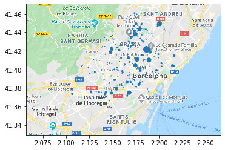

# SM-Transport

En aquest repositori trobarem tots els arxius necessaris perque la nostra aplicació es desenvolupi. 

### APP
Primer de tot a la carpeta app trobarem el arxius de configuració de l'aplicació així com el main.py que es comunica amb les funcions de cloud que implementen les funcionalitats.

### Datasets
A datasets trobem els csv necessaris per tal de simular lo més proper a la realitat possibles rutes introduïdes pels usuaris. Per tal de fer axiò s'utilitzen datasets de la densitat de població de Barcelona per distrites i la densitat del trànsit per hores per tal de generar el random_user_data.

### Heatmaps
A heatmaps trobem les imatges utilitzades per generar el gif de buble-plots, i on es poden veure les zones amb més trànsit per cada hora.

### Scripts

En aquesta carpeta podem trobar els scrips necessaris per tal de que funcioni el nostre portal web.

- Gen_data_users.py ens serveix per generar les dades dels usuaris que estan utilitzant la nostra aplicació, que genera el csv random_user_data.

- Gen_data_horaris.py ens serveix per extreure les dades de tràfic de Barcelona a partir del dataset de dades de trànsit de gener, i genera el csv densitat_hores_barcelona.

- Heatmaps.py s'encarrega de generar els buuble-plots que hem comentat a l'apartat de Heatmaps

- Hora_script.py s'encarrega d'insertar a la taula d'hores_tram els trams per cada hora amb l'ajuda del scheduler.

- Database Creation_Sql conté el codi en sql encarregat de generar les taules de la nostra base de dades per poder guardar les dades dels usuaris i de les rutes o trams associats a aquest.

